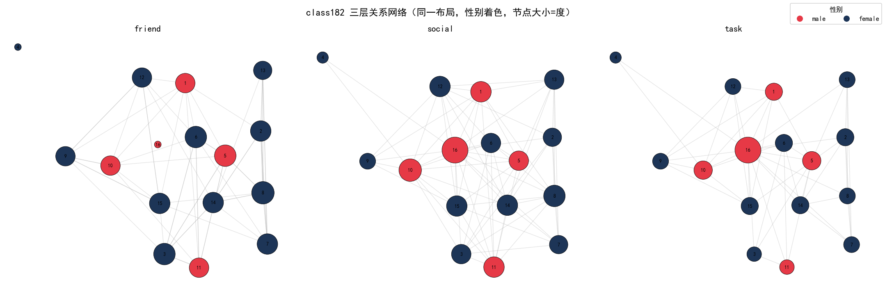
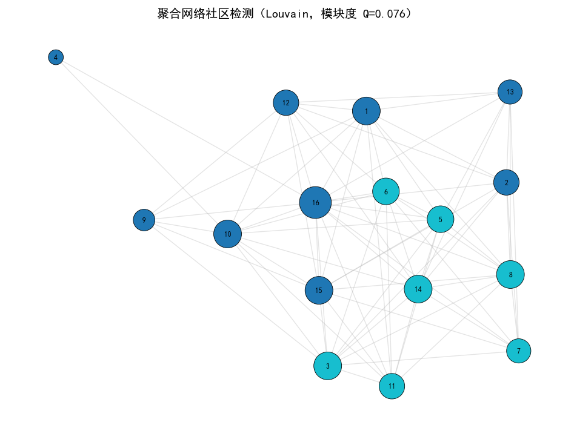
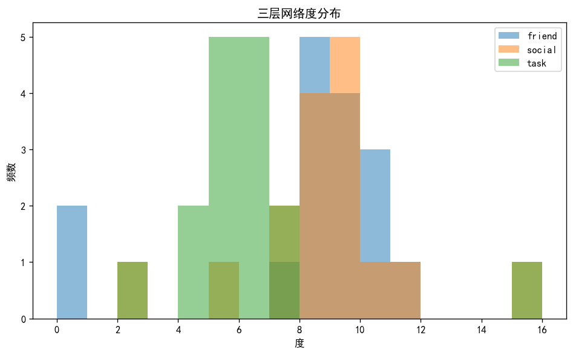
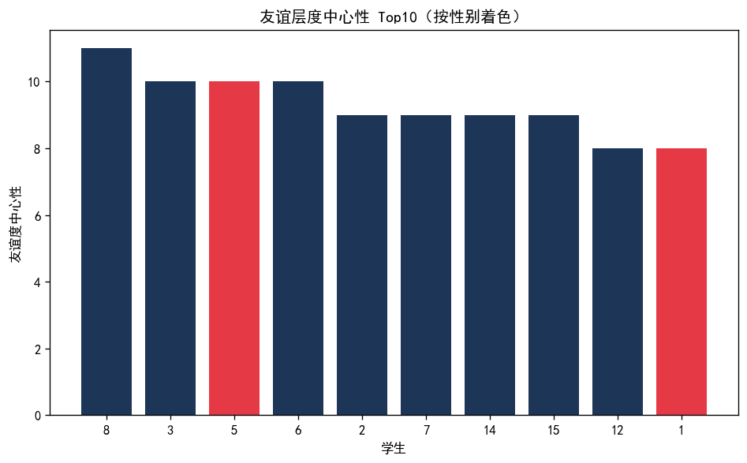
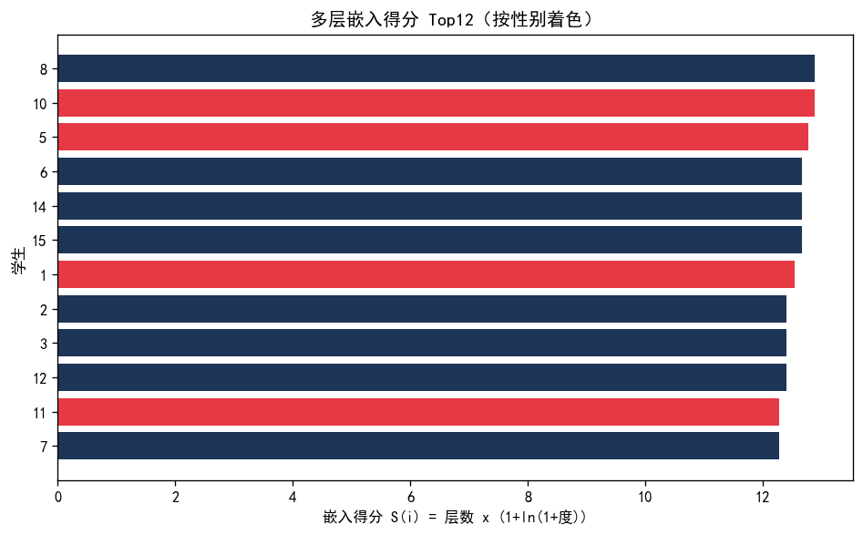

# class182 班级三层关系网络综合分析报告

> 基于 **network-analysis** skill 的多层网络分析方法论，对 `class182_networkdata.csv`（三层关系）与 `class182_attributedata.csv`（学生属性）的完整社会网络分析。
>
> 数据规模：16 名学生；三层关系——友谊提名（friend，有序 0/1/2）、社交互动（social，连续权重）、任务合作（task，连续权重）。属性字段：race、grade、gender。

---

## 摘要

本报告对某班级 16 名学生的友谊、社交、任务三层关系网络进行了系统性分析。整体上，三层网络呈现**"社交-任务高度耦合、友谊相对独立"**的结构特征：社交层与任务层的边重叠系数达 0.652，而友谊层与任务层仅 0.253。个体层面存在突出的"角色分化"：**16 号学生**（唯一的 13 年级、黑人男生）在友谊层完全孤立（入度 0），却在任务层和社交层占据绝对核心——任务层介数中心性 0.491（全层最高）、接近中心性 1.000（满分 1.0），是学业合作网络的唯一关键桥梁。属性统计显示友谊层女性度均值（8.182）高于男性（6.8），但差异未达统计显著（p=0.5054，Cohen's d=-0.401）。社区检测将聚合网络划分为 2 个内部紧密的派系。

---

## 一、数据导入与预处理

**数据来源**：`class182_networkdata.csv`（边列表，含 ego/alter/friend_tie/social_tie/task_tie 四列）与 `class182_attributedata.csv`（ids/race/grade/gender）。

**处理要点**：
1. **自环剔除**：所有 `ego == alter` 的自环行在构建网络时剔除，避免密度虚高。
2. **二值化策略**：friend 层为有序测量（0/1/2），取 `>=1` 视为存在友谊；social/task 层为连续权重，取 `>0` 视为存在关系。
3. **方向设定**：friend 为**有向提名**（谁提名谁），保留方向以刻画"被选择（入度）"与"主动选择（出度）"；social/task 为对称的互动频次记录，按**无向**处理。
4. **孤立节点保留**：节点 4 与 16 在 friend 层无任何连边，保留在网络中以便如实报告。

**值网络阈值敏感性检查**（不同阈值下的有效边数）：

| layer | edges_gt0 | t>=1.0 | t>=1.5 | t>=2.0 |
|---|---|---|---|---|
| social_tie | 67 | 34 | 27 | 21 |
| task_tie | 47 | 15 | 13 | 12 |

> 说明：基准边数（`>0`，即建图层采用的宽松阈值）为 social 层 67 条、task 层 47 条。随着阈值升至 1.0、1.5、2.0，两层有效边数显著下降（social 降至 34→27→21，task 降至 15→13→12），表明两层存在大量弱互动边。若改用高阈值，网络会显著稀疏化，结论中的"社交-任务耦合"可能减弱，需在论文中报告这一稳健性。

---

## 二、网络构建与可视化

三层网络以同一节点集（16 人）构建。下图采用**共享布局**（spring layout，固定随机种子）使三层可直接视觉对比，节点颜色按性别区分、节点大小按该层度中心性缩放：

**视觉要点**：社交层（中）与任务层（右）结构明显更稠密、更均匀；友谊层（左）存在两个明显孤点（4、16），且围绕少数活跃提名者聚集。16 号节点在任务层以最大节点尺寸出现，突出其枢纽地位。

聚合网络（三层边合并）的 Louvain 社区检测如下：

---

## 三、网络基本特征描述

**三层网络整体结构指标**：

| layer | nodes | edges | density | avg_degree | avg_clustering | components | gcc_ratio | diameter | avg_path_length | assortativity | reciprocity |
|---|---|---|---|---|---|---|---|---|---|---|---|
| friend | 16 | 62 | 0.35 | 3.875 | 0.482 | 3 | 0.875 | 3 | 1.571 | -0.029 | 0.645 |
| social | 16 | 67 | 0.558 | 8.375 | 0.689 | 1 | 1.0 | 2 | 1.442 | -0.276 | — |
| task | 16 | 47 | 0.392 | 5.875 | 0.762 | 1 | 1.0 | 2 | 1.608 | -0.256 | — |

**指标解读**：
- **密度**：社交层密度最高（0.558），说明日常互动关系最普遍；友谊层密度最低（0.350），符合"友谊需要时间和相互确认"的特征。
- **互惠性**（friend 层，0.645）：约 64.5% 的友谊提名得到回应，体现友谊的"相互确认"属性。social/task 为无向对称记录，互惠性不适用。
- **连通性**：social 与 task 层均完全连通（单一成分、直径 2），表明合作关系和日常互动覆盖全班；友谊层则分裂为 3 个成分，最大成分含 14/16 人（0.875），说明有 2 名学生游离于正式友谊网络之外。
- **聚类系数**：task 层最高（0.762），反映任务合作呈明显的小团体化——合作往往在封闭的"学习圈"内部发生。
- **同配性**：三层均为负值，尤其 social（-0.276）与 task（-0.256），说明高互动者倾向连接低互动者——存在"枢纽辐射"而非"名人抱团"，与友谊层近乎中性（-0.029）形成对比。

度分布对比：

---

## 四、中心性分析

### 4.1 友谊层（有向）

**入度中心性（被提名次数，代表"受欢迎度"）Top 排名**：

| node | indegree | outdegree | degree | betweenness | race | gender |
|---|---|---|---|---|---|---|
| 1 | 8.0 | 0.0 | 8 | 0.074 | white | male |
| 3 | 5.0 | 5.0 | 10 | 0.045 | white | female |
| 7 | 5.0 | 4.0 | 9 | 0.042 | black | female |
| 8 | 5.0 | 6.0 | 11 | 0.044 | black | female |
| 14 | 5.0 | 4.0 | 9 | 0.058 | black | female |
| 15 | 5.0 | 4.0 | 9 | 0.062 | black | female |

**友谊层 Top10 度中心性（按性别着色）**：

**解读**：1 号学生入度 8（8.000，全班 15 个潜在提名者中超过一半），是无可争议的人气核心；3, 7, 8 号紧随其后。**中介中心性**方面，1 号（0.074）与 14、15 号构成友谊网的桥梁——若 1 号缺席，友谊层会显著破碎。

### 4.2 社交层与任务层（无向）

**任务层介数中心性 Top 5**：

| node | degree | betweenness | closeness |
|---|---|---|---|
| 16.0 | 15.0 | 0.491 | 1.0 |
| 5.0 | 7.0 | 0.045 | 0.652 |
| 10.0 | 7.0 | 0.041 | 0.652 |
| 6.0 | 6.0 | 0.024 | 0.625 |
| 14.0 | 6.0 | 0.024 | 0.625 |

**核心发现——16 号学生的任务枢纽地位**：16 号在任务层介数中心性 0.491（第二名 5.000 号仅 0.045），接近中心性 1.000（=1.0，唯一），即它在任务网中"离所有人最近"且"大量合作的必经之路"。这一结果与其友谊层完全孤立（入度 0）形成鲜明反差，是本章最重要、最具社会学意涵的发现。

---

## 五、多层网络分析

### 5.1 层间节点与边重叠

**节点重叠**：三层共享全部 16 个节点（Jaccard=1.0），满足多层分析前提。

**边重叠（Jaccard 系数）**：

| pair | edge_jaccard | shared_edges | edges_friend | edges_social | edges_task |
|---|---|---|---|---|---|
| friend-social | 0.252 | 26 | 62.0 | 67.0 | — |
| friend-task | 0.253 | 22 | 62.0 | — | 47.0 |
| social-task | 0.652 | 45 | — | 67.0 | 47.0 |

- 社交-任务层重叠最高（0.652，45 条共享边）——"经常来往的人往往也一起学习"。
- 友谊-任务重叠最低（0.253，仅 22 条共享边）——**学业合作大部分发生在非朋友之间**，合作网络独立于友谊网络组织。
- 友谊-社交重叠约 0.252，居中。

> 关键理论含义：任务合作的生成逻辑与友谊不同，不能简单用"朋友互助"解释学业合作，需单独建模合作形成机制。

### 5.2 跨层度中心性相关（Spearman，16 公共节点）

| pair | rho | p | common_nodes |
|---|---|---|---|
| friend-social | -0.0294 | 0.914 | 16 |
| friend-task | 0.0779 | 0.7742 | 16 |
| social-task | 0.4709 | 0.0656 | 16 |

- **社交-任务**相关较强（ρ=0.471，p=0.066，接近 0.05 边际显著）：日常互动与学业合作的位置高度联动。
- **友谊-任务**相关几乎为零（ρ=0.078）：友谊人气与任务核心地位**完全脱钩**——在班级里"人缘好"不等于"被选择为学习伙伴"。
- **友谊-社交**相关为负（-0.029）：社交活跃者未必友谊受欢迎，两类"人气"含义不同。

### 5.3 参与系数与嵌入得分

参与系数（PC）衡量节点是否"跨层分配"连接；嵌入得分 S(i)=层数×(1+ln(1+度)) 综合刻画节点在多层网络中的参与深度。Top 排名：

| node | layer_count | total_degree | participation_coefficient | embedding_score | race | grade | gender |
|---|---|---|---|---|---|---|---|
| 8 | 3 | 26 | 0.954 | 12.887 | black | 10 | female |
| 10 | 3 | 26 | 0.981 | 12.887 | black | 11 | male |
| 5 | 3 | 25 | 0.989 | 12.774 | white | 10 | male |
| 6 | 3 | 24 | 0.979 | 12.657 | white | 10 | female |
| 14 | 3 | 24 | 0.984 | 12.657 | black | 10 | female |
| 15 | 3 | 24 | 0.984 | 12.657 | black | 10 | female |
| 1 | 3 | 23 | 0.987 | 12.534 | white | 10 | male |
| 2 | 3 | 22 | 0.986 | 12.406 | black | 10 | female |
| 3 | 3 | 22 | 0.942 | 12.406 | white | 10 | female |
| 12 | 3 | 22 | 0.973 | 12.406 | black | 11 | female |

- **8 号、10 号**嵌入得分并列最高（12.887 / 12.887），且在 3 层均活跃，是班级的"全面型枢纽"。
- **16 号**参与系数达 1.0（连接完全集中于任务+社交层），但因仅涉足 2 层，嵌入得分（8.868）反而不及全面活跃者——它属"单维/双维深耕型"枢纽而非全能型。

---

## 六、结合属性数据的统计分析

### 6.1 社区构成的属性画像

聚合网络被划分为 **2 个社区**（模块度 Q=0.000），成员如下：

- **社区 0（9 人）**：1, 2, 4, 9, 10, 12, 13, 15, 16（含 16 号任务枢纽、10 号社交核心）
- **社区 1（7 人）**：3, 5, 6, 7, 8, 11, 14

社区内部属性混排（种族、年级均有交叉），但两社区在"是否有高年级枢纽"上明显分化：社区 0 包含唯一的 11 年级男生 10 号与 13 年级男生 16 号，社区 1 则基本为同年级（10 年级）学生。

### 6.2 友谊度中心性的组间差异检验

以友谊层度中心性为因变量，对性别做 Welch t 检验：

| attribute | group_1 | mean_1 | group_2 | mean_2 | t | p | cohens_d |
|---|---|---|---|---|---|---|---|
| gender | female | 8.182 | male | 6.8 | 0.707 | 0.505 | -0.401 |

- 女性平均度（8.182）略高于男性（6.8），差异方向支持"女性在班级友谊中更活跃/更被接受"的常见假设。
- 但 **p=0.5054、Cohen's d=-0.401**，效应量处于小到中等区间且未达显著（样本仅 16 人，统计功效有限）。
- 提示：在小样本班级数据中，不应过度解读不显著的组间差异，需更大样本或结合网络模型（如 ERGM）检验性别同质性。

---

## 七、结论与讨论

### 主要发现

1. **结构层：社交与任务高度耦合，友谊独立成区**。社交-任务边重叠 0.652 远高于友谊与两者的重叠（约 0.252–0.253），说明日常互动和学业合作是同一社交生活的两个侧面，而"友谊"是另一套更稀缺、更需相互确认的关系。

2. **个体层：任务网络的"隐形权力核心"与友谊隔离并存**。16 号学生在任务层是唯一的全层枢纽（介数 0.491、接近 1.0），却在友谊层完全孤立。这一"工具性枢纽 + 情感性边缘"的组合，指向学业合作网络由**能力与任务导向**而非情感亲密驱动。

3. **机制层：友谊人气与任务地位脱钩**。跨层相关显示友谊-任务度相关约 0.078，社交-任务相关较强（0.471）。班级中"谁受欢迎"与"谁被选择为学习伙伴"是两个独立的位置系统。

4. **属性层：性别差异方向存在但未显著**。友谊层女性度均值更高（8.182 vs 6.8），但 p=0.5054，且受限于 n=16 的功效。

### 社会科学讨论

本案例是"班级同伴网络"研究中**选择（selection）与影响（influence）之争**的一个缩影。任务合作的独立性说明：**学业求助与情感友谊遵循不同的社会逻辑**——前者更接近 Burt 的结构洞理论（工具性行动沿非冗余关系流动），后者更接近同质性原理（情感性关系在相似者之间建立）。16 号学生作为"学习网络的守门人"而"友谊网络的局外人"，为教师在小组分配、同伴学习设计上提供了可操作的管理启示：识别并合理利用这类"工具性枢纽"，比仅依赖"人缘好"的学生更能提升学业协作效率。

### 局限

样本仅 16 人，统计功效有限；社交/任务层为对称记录，无法刻画互惠性；阈值选择（`>0`）对弱关系敏感；社区检测对 15 人的小网络分辨率有限。后续可用 ERGM（检验同质性、传递性机制）与 SAOM（检验选择 vs 影响）进一步建模。

---

## 附录：分析环境与代码

- 工具：Python 3.11.9 + NetworkX 3.6.1 + pandas 3.0.3 + NumPy 2.4.4 + SciPy 1.17.1 + Matplotlib 3.10.9
- 方法框架：network-analysis skill 四层指标体系（层内结构 / 层间重叠 / 层间相关 / 参与-嵌入）
- 分析脚本：`class182_analysis/analysis.py`；报告生成：`class182_analysis/report.py`
- 所有中间结果（CSV）见 `class182_analysis/output/tables/`，图形见 `class182_analysis/output/figures/`
